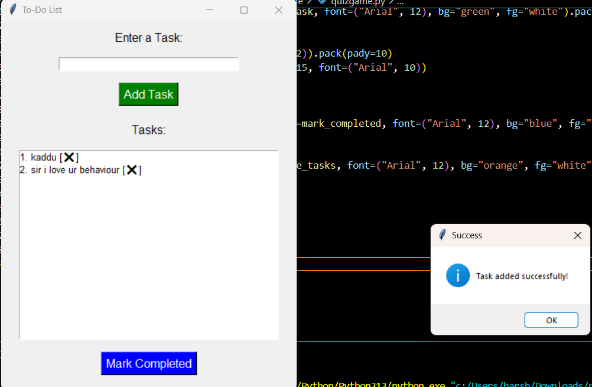

# To-Do List Application

## **Description**
A command-line application to manage daily tasks. Users can add, view, and mark tasks as completed. Tasks persist between sessions.

---

## **Features**
- Add tasks with descriptions.
- View all tasks with their completion status.
- Mark tasks as completed.
- Save and load tasks from a file.

---

## **Requirements**
- Python 3.x
- No additional libraries required.

---

## **How to Run**
1. Save the code as `todo_list.py`.
2. Run the script using the following command:
   ```bash
   python todo_list.py
   ```
## Screenshot


